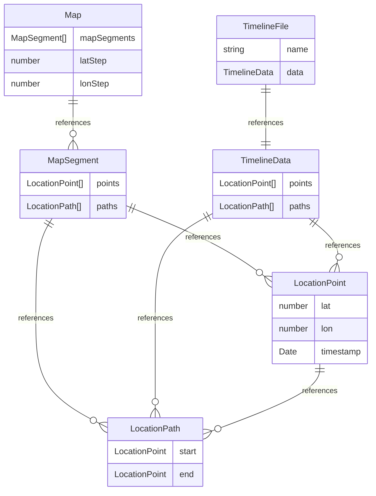

# Clean Architecture - Google Timeline Fog of War
This document describes the architectural principles and structure of the refactored codebase.

This is pure SPA application with no backend services (except 3rd-party [OpenStreetMap](https://www.openstreetmap.org) used for map rendering and address search).

## 🏛️ Architecture Overview
The application follows **Clean Architecture** principles with **Domain-Driven Design (DDD)** patterns, featuring clear separation of concerns across four distinct layers:
```
┌────────────────────────────────────────────────────────┐
│                   Presentation Layer                   │
│              (React Components & Hooks)                │
├────────────────────────────────────────────────────────┤
│                   Application Layer                    │
│                (Use Cases & Services)                  │
├────────────────────────────────────────────────────────┤
│                  Infrastructure Layer                  │
│         (Persistence, Parsers, External APIs)          │
├────────────────────────────────────────────────────────┤
│                     Domain Layer                       │
│     (Aggregates, Entities, Value Objects, Services)    │
└────────────────────────────────────────────────────────┘
```

### Key Principles
1. **Dependency Rule**: Dependencies point inward. Domain has no dependencies. Infrastructure depends on domain, etc.
2. **Separation of Concerns**: Each layer has a single responsibility
3. **Domain Owns Business Logic**: Spatial indexing, geographical queries, and map management are domain concerns, not infrastructure
4. **Aggregate Roots**: The `Map` entity acts as an aggregate root, managing spatial organization and enforcing invariants
5. **Reference-Based Architecture**: Entities link to each other via references, not copies, ensuring memory efficiency for large datasets
6. **Testability**: Pure business logic isolated from framework code
7. **Flexibility**: Easy to swap implementations (e.g., different storage backends)

## 📁 Project Structure
```
src/
├── domains/                      # Core business logic (no dependencies)
|   ├── map/                         # Core business logic calculating map (core or code)
|   │   ├── entities.ts
|   │   ├── value-objects.ts
|   │   └── services.ts  
|   └── settings/                     # Business logic managin user settings
|       ├── entities.ts
|       ├── value-objects.ts
|       └── services.ts
│
├── application/                 # Use cases and application services
│   ├── timeline-file-service.ts # File management use case
│   └── settings-service.ts      # Settings management use case
│
├── infrastructure/              # External systems and implementations
│   ├── parsers/
│   │   └── timeline-parser.ts   # iOS & Android format parsers
│   ├── repositories/
│   │   ├── map-repository.ts           # Map aggregate persistence (includes all files)
│   │   └── settings-repository.ts      # Settings persistence
│   ├── analytics.ts             # External analytics integration
│   └── service-container.ts     # Dependency injection container
│
├── presentation/                # UI layer (React specific)
│   ├── components/              # React components
│   │   ├── AddressSearch.tsx
│   │   ├── ControlPanel.tsx
│   │   ├── FileList.tsx
│   │   ├── FileUpload.tsx
│   │   └── SidePanel.tsx
│   └── hooks/                   # Custom React hooks
│       ├── useFogSettings.ts
│       ├── useMap.ts
│       ├── useMapViewport.ts
│       └── useTimelineFiles.ts
│
├── test/                        # Test files
│   ├── domain.test.ts
│   ├── parser.test.ts
│   └── storage.test.ts
│
├── App.tsx                      # Main application entry
└── main.tsx                     # React bootstrap
```

## 🗺️ Domains
There are 2 domains:
* `Map` - the core of core. Handles all the business logic and math including optimisations.
* `Settings` - handles user settings

### `Map` domain
#### Key Domain Concepts
- Entities store **references** to other entities, never copies
- Memory-efficient for large datasets (millions of points)
- Repositories serialize/deserialize these references appropriately

#### Value Objects
##### `ViewportBounds`
```typescript
const bounds = new ViewportBounds(
  minLat: 47.0, maxLat: 48.0,
  minLon: -123.0, maxLon: -122.0
);
```

### Entities


#### `LocationPoint`
- Represents a point on the map at the specific time
- Performs validation (lat: [-90, 90], lon: [-180, 180])

```typescript
class LocationPoint {
  readonly lat: number;
  readonly lon: number;
  readonly timestamp: Date;
  
  constructor(lat: number, lon: number, timestamp: Date); // performs validation
  
  distanceTo(other: LocationPoint): number;
}
```

#### `LocationPath`
- Represents movement from point A to point B
- Contains **references** to 2 `LocationPoint` objects

```typescript
class LocationPath {
  readonly start: LocationPoint;
  readonly end: LocationPoint;
  readonly length: number;
  
  constructor(start: LocationPoint, end: LocationPoint);
  
  intersectsCell(minLat: number, maxLat: number, minLon: number, maxLon: number): boolean;
}
```

#### `MapSegment`
- Manages **references** to points and paths within a grid cell
```typescript
class MapSegment {
  private pointRefs: Set<LocationPoint>;
  private pathRefs: Set<LocationPath>;
  
  addPoints(...point: LocationPoint[]): void;
  addPaths(...path: LocationPath[]): void;
  removePoints(...points: LocationPoint[]): void;
  removePaths(...paths: LocationPath[]): void;
  getPoints(): LocationPoint[];
  getPaths(): LocationPath[];
}
```

#### `TimelineData`
- Represents all points imported from a specific file
```typescript
class TimelineData {
  readonly points: LocationPoint[];
  readonly paths: LocationPath[];
  
  constructor(points: LocationPoint[], paths: LocationPath[]);
}
```

#### `TimelineFile`
- Represents a file imported by user
```typescript
class TimelineFile {
  readonly name: string;
  readonly size: number;
  readonly data: TimelineData;
  
  constructor(name: string, data: TimelineData);
}
```

#### `Map`
- Manages all spatial data in the application
- Organizes data into `MapSegment` grid cells for efficient viewport queries.
  - Stored in array using formula: `index = (lat ÷ gridSize) × lonCount + (lon ÷ gridSize)`
  - default: 1° x 1° ≈ 111km
- Contains **references** to `TimeLineFile` objects
- Enforces spatial indexing invariants (e.g., segments must intersect all grid cells they span)
- Maintains consistency across all contained entities

```typescript
class Map {
  private readonly latMin: number = -90;
  private readonly latMax: number = -90;
  private readonly latStepCounts: number = 180;

  private readonly lonMin: number = -180;
  private readonly lonMax: number = -180;
  private readonly lonStepCounts: number = 360;

  private grid: MapSegment[]; // size = latStepCounts * lonStepCounts

  private files: TimelineFile[]; // Track all files in map
  
  static createEmpty(): Map;
  static fromJson(data: Object): Map;
  toJson(): Object;

  queryViewport(bounds: ViewportBounds): { paths: LocationPath[], points: LocationPoint[] };
  addFile(file: TimelineFile): void;
  removeFile(file: TimelineFile): void;
  getStatistics(): { pointsCount: number, pathsCount: number};
  getAllFiles(): TimelineFile[];
}
```

### `Settings` domain
Manages user preferences for visualization.

#### Value Objects
##### `FogSettings`
Immutable configuration for fog of war visualization:
```typescript
class FogSettings {
  readonly radius: number;        // Fog radius in kilometers
  readonly showRoads: boolean;    // Whether to show roads
  readonly opacity: number;       // Fog opacity (0-1)
  
  private constructor(radius: number, showRoads: boolean, opacity: number);
  
  static default(): FogSettings;
  
  withRadius(radius: number): FogSettings;      // Returns new instance
  withShowRoads(show: boolean): FogSettings;    // Returns new instance
  withOpacity(opacity: number): FogSettings;    // Returns new instance
}
```

### 2. Application Layer (Use Cases)
**Principle**: Orchestrates domain objects to fulfill application requirements. Does NOT contain business logic.

#### Timeline File Service (`application/timeline-file-service.ts`)
Coordinates file upload, parsing, map updates, and persistence.
```typescript
class TimelineFileService {
  constructor(
    private mapRepository: MapRepository
  ) {}
  
  async uploadFiles(files: File[]): Promise<TimelineFile[]> {
    // 1. Parse files (via TimelineParserFactory) to get TimelineData
    // 2. Create TimelineFile entities with parsed data
    // 3. Load Map from repository
    // 4. map.addFile(file) - domain handles spatial indexing
    // 5. Save map via repository
  }
  
  async loadMap(): Promise<Map> {
    // Load Map from repository (uses Map.fromJson())
  }
  
  async getAllFiles(): Promise<TimelineFile[]> {
    const map = await this.loadMap();
    return map.getAllFiles();
  }
  
  async removeFile(file: TimelineFile): Promise<void> {
    const map = await this.loadMap();
    map.removeFile(file);
    await this.mapRepository.save(map);
  }
  
  async getVisibleData(bounds: ViewportBounds): Promise<{ points: LocationPoint[], paths: LocationPath[] }> {
    const map = await this.loadMap();
    return map.queryViewport(bounds);
  }
}
```

Key responsibilities:
- Orchestrates domain objects (Map, TimelineFile, TimelineData)
- Coordinates with repositories for persistence
- Delegates business logic to domain (Map handles all spatial operations)

#### Settings Service (`application/settings-service.ts`)
Manages application settings with persistence.
```typescript
class SettingsService {
  constructor(
    private settingsRepository: SettingsRepository
  ) {}
  
  async loadSettings(): Promise<FogSettings> {
    const settings = await this.settingsRepository.load();
    return settings || FogSettings.default();
  }
  
  async updateRadius(radius: number): Promise<FogSettings> {
    const current = await this.loadSettings();
    const updated = current.withRadius(radius);
    await this.settingsRepository.save(updated);
    return updated;
  }
  
  async toggleRoads(): Promise<FogSettings> {
    const current = await this.loadSettings();
    const updated = current.withShowRoads(!current.showRoads);
    await this.settingsRepository.save(updated);
    return updated;
  }
  
  async resetToDefaults(): Promise<FogSettings> {
    const defaults = FogSettings.default();
    await this.settingsRepository.save(defaults);
    return defaults;
  }
}
```

### 3. Infrastructure Layer (External Systems)
**Principle**: Implements interfaces for external systems and frameworks. Does NOT contain business logic - only persistence, parsing, and external API integration.

#### Repositories (`infrastructure/repositories/`)
##### `MapRepository`
Persists and reconstructs the entire Map aggregate using **IndexedDB**:

```typescript
class MapRepository {
  private db: IDBDatabase; // IndexedDB for large datasets
  
  async save(map: Map): Promise<void> {
    const json = map.toJson();
    await this.db.put('map-data', json);
  }
  
  async load(): Promise<Map | null> {
    const json = await this.db.get('map-data');
    if (!json) return Map.createEmpty();
    return Map.fromJson(json);
  }
  
  async clear(): Promise<void> {
    await this.db.delete('map-data');
  }
}
```

Key responsibilities:
- **IndexedDB storage**: Handles large datasets efficiently (millions of points)
- **Simple serialization**: Uses Map.toJson() / Map.fromJson() methods
- **Includes all files**: Map tracks all TimelineFile entities
- **No business logic**: Just stores/loads JSON representation

##### `SettingsRepository`
Persists user settings:
```typescript
class SettingsRepository {
  async save(settings: FogSettings): Promise<void>;
  async load(): Promise<FogSettings | null>;
}
```

#### Parsers (`infrastructure/parsers/timeline-parser.ts`)
Multi-format timeline parsing with strategy pattern:

- `IOSTimelineParser`: Parses iOS format (`geo:lat,lon`)
- `AndroidTimelineParser`: Parses Android format (`"lat°, lon°"`)
- `TimelineParserFactory`: Auto-detects and selects appropriate parser

**Simplified signature**:
```typescript
interface ITimelineParser {
  canParse(data: any): boolean;
  parse(data: any, fileName: string, fileSize: number): TimelineFile;
}

// Usage - parser creates complete TimelineFile with its data
const file = TimelineParserFactory.parse(json, 'data.json', 1024);
const format = TimelineParserFactory.detectFormat(json); // 'ios' | 'android'
```

Key responsibilities:
- Parse external file formats into domain objects (`TimelineFile` with `TimelineData`)
- Create complete file entity ready to add to Map
- Format detection and validation
- Error handling for malformed files

**Workflow**:
- Parser creates LocationPoint and LocationPath objects from raw JSON
- Parser creates TimelineData containing those objects
- Parser creates TimelineFile with metadata and data
- Application service: `map.addFile(file)`

#### Service Container (`infrastructure/service-container.ts`)
Dependency injection container (Singleton pattern):
```typescript
const container = ServiceContainer.getInstance();
const timelineService = container.timelineFileService;
const map = await timelineService.loadMap(); // Returns Map aggregate
```

### 4. Presentation Layer (UI)
**Principle**: React-specific code, isolated from business logic. Consumes domain/application services via hooks.

#### Custom Hooks (`presentation/hooks/`)
Encapsulate state management and side effects:
- `useTimelineFiles`: File management state (upload, remove, list)
- `useFogSettings`: Settings management state
- `useMap`: Map rendering and viewport queries
- `useMapViewport`: Viewport bounds tracking for efficient queries

**Example**:
```typescript
const { files, uploadFiles, removeFile } = useTimelineFiles(service);

// Viewport-based querying
const { visibleData } = useMapViewport(map, viewport);
// Only queries Map for points/segments within visible bounds
```

#### Components (`presentation/components/`)
Pure presentational components:

- `SidePanel`: Main control panel container
- `ControlPanel`: Settings controls (fog radius, road visibility)
- `FileList`: File list display
- `FileUpload`: File upload UI  
- `AddressSearch`: Location search interface

## 🔄 Data Flow
### File Upload Flow
```
User selects files
    ↓
FileUpload component
    ↓
useTimelineFiles hook
    ↓
TimelineFileService.uploadFiles()
    ↓
TimelineParserFactory.parse() → TimelineFile (with TimelineData)
    ↓
map.addFile(file) ← Map aggregate handles spatial indexing
    ↓
MapRepository.save(map)  ← Single save (includes all files)
    ↓
UI re-renders with new data
```

### Viewport Query Flow
```
User pans/zooms map
    ↓
useMapViewport updates bounds
    ↓
map.queryViewport(bounds) ← Map performs efficient grid query
    ↓
Returns { points, paths } in viewport
    ↓
useMap renders fog overlay
    ↓
Canvas renders visible data only
```

### File Removal Flow
```
User clicks remove
    ↓
useTimelineFiles.removeFile(file)
    ↓
TimelineFileService.removeFile(file)
    ↓
map.removeFile(file) ← Domain handles removal
    ↓
MapRepository.save(map)
    ↓
UI updates
```

## 💾 Persistence Strategy
### Map Aggregate Persistence
**Challenge**: The Map aggregate may contain millions of points. How do we efficiently persist and restore it?
**Strategy Options**:

**Option 1: Full Serialization (Recommended)**
- Serialize entire Map with grid structure using `toSerializable()` / `fromSerializable()`
- Pros: **Fast reconstruction** (no recalculation), preserves optimization, instant app start
- Cons: More complex serialization logic, larger storage footprint
- Best for: **All dataset sizes** when fast startup is critical

**Option 2: Data-Only Storage (Fallback)**
- Store only raw TimelineData with file associations
- Reconstruct Map on load: `Map.fromData(allPoints, allSegments)`
- Pros: Simple, storage-efficient, self-healing (rebuilds index)
- Cons: **Rebuild time on app start** (1M points ≈ 1-2 seconds)
- Best for: When storage space is more critical than startup time

**Implementation**:
```typescript
class MapRepository {
  async save(map: Map): Promise<void> {
    const json = map.toJson();
    await this.storage.set('map-data', json);
  }

  async load(): Promise<Map | null> {
    const json = await this.storage.get('map-data');
    if (!json) return Map.createEmpty();
    return Map.fromJson(json);
  }
}
```

**Map handles its own serialization**:
- `toJson()` converts Map to plain object (JSON-serializable)
- `fromJson()` reconstructs Map from plain object
- All serialization logic is in the domain layer
- Repository just handles storage operations

### Reference Integrity

**In-Memory (Runtime)**:
```typescript
// Same LocationPoint referenced by multiple MapSegments and LocationPaths
const point = new LocationPoint(47.0, -122.0, timestamp);
mapSegment1.addPoints(point); // Reference
mapSegment2.addPoints(point); // Same reference, not a copy
const path = new LocationPath(point, otherPoint); // path.start references same point
```

**Serialization**:
- Map handles its own serialization via `toJson()` / `fromJson()`
- Internal implementation maintains reference integrity
- Domain logic ensures proper object reconstruction

**Benefits**:
- Single source of truth for each object
- Memory efficient (objects referenced, not copied)
- Type-safe references at runtime
- Serialization details encapsulated in domain

## 🎯 Design Patterns Used

### 1. Aggregate Pattern (DDD)
Map is an aggregate root managing MapSegments:
```typescript
class Map {
  private grid: MapSegment[]; // Encapsulated
  private files: TimelineFile[];
  
  // Public aggregate interface
  queryViewport(bounds: ViewportBounds): { points: LocationPoint[], paths: LocationPath[] }
  addFile(file: TimelineFile): void
  removeFile(file: TimelineFile): void
  
  // Serialization
  toJson(): Object
  static fromJson(data: Object): Map
}
```

### 2. Repository Pattern
Abstracts data access for aggregates:
```typescript
interface MapRepository {
  save(map: Map): Promise<void>;
  load(): Promise<Map | null>;
  clear(): Promise<void>;
}
```

### 3. Strategy Pattern
Different parsers for different formats:
```typescript
interface ITimelineParser {
  canParse(data: any): boolean;
  parse(data: any, fileName: string, fileSize: number): TimelineFile;
}
```

### 4. Factory Pattern
Creates appropriate parser based on data:
```typescript
TimelineParserFactory.parse(data, fileName, fileSize); // Auto-selects parser
```

### 5. Service Layer Pattern
Use cases orchestrate domain logic:
```typescript
class TimelineFileService {
  constructor(
    private mapRepository: MapRepository
  ) {}
  
  async uploadFiles(files: File[]): Promise<TimelineFile[]> {
    // Orchestrate: parse → map.addFile() → persist
  }
}
```

### 6. Dependency Injection
Services receive dependencies via constructor:
```typescript
const mapRepo = new MapRepository();
const settingsRepo = new SettingsRepository();
const timelineService = new TimelineFileService(mapRepo);
const settingsService = new SettingsService(settingsRepo);
```

### 7. Immutable Value Objects
Value objects never mutate, always create new instances:
```typescript
const settings = FogSettings.default();
const newSettings = settings.withRadius(2.0); // Returns new instance
const withRoads = newSettings.withShowRoads(true); // Returns another new instance
```

### 8. Reference-Based Architecture
Entities reference each other, never copy:
```typescript
class MapSegment {
  private pointRefs: Set<LocationPoint>; // References
  
  addPoint(point: LocationPoint): void {
    this.pointRefs.add(point); // Store reference, not copy
  }
}
```

## ✅ Benefits

### Domain-Driven Design

- **Business Logic in Domain**: Spatial indexing is a core business capability, now properly owned by the domain layer
- **Aggregate Root**: Map entity enforces consistency and provides clear boundaries
- **Ubiquitous Language**: Methods like `queryViewport()`, `addTimelineData()` reflect domain concepts
- **Encapsulation**: Grid implementation hidden, only domain interface exposed

### Memory Efficiency

- **Reference-Based**: Single point/segment stored once, referenced by multiple segments
- **No Duplication**: Sets ensure automatic deduplication
- **Scalability**: Can handle millions of points without excessive memory overhead
- **Lazy Loading Potential**: Future optimization - load only active grid cells

### Maintainability

- **Clear boundaries**: Each layer has well-defined responsibilities
- **Easy navigation**: Predictable file organization
- **Self-documenting**: Structure reveals intent
- **Domain isolation**: Business logic changes don't affect infrastructure

### Testability

- **Domain layer**: Pure functions, easily tested without mocks
- **Map aggregate**: Test spatial queries with known data sets
- **Mocked dependencies**: Services can be tested in isolation
- **Repository contracts**: Can swap test implementations

### Flexibility

- **Swap storage**: Easy to change from IndexedDB to API or file system
- **Add formats**: New parsers without touching existing code
- **UI framework independence**: Domain/application layers agnostic to React
- **Persistence strategy**: Can switch between full serialization or rebuild on load

### Performance

- **Efficient queries**: O(1) grid cell lookup, then filter only relevant cells
- **Viewport-based rendering**: Only query/render visible data
- **Background loading**: Repositories can load Map asynchronously on app start
- **Index rebuild**: Can optimize grid size based on data distribution

## 🚀 Performance Characteristics

### Spatial Index Efficiency

**Grid-Based Spatial Index** (implemented in Map aggregate):
- Grid cell size: 1° x 1° (≈ 111km at equator)
- Query time: O(cells × items_per_cell) - typically much smaller than O(n)
- Memory: O(n) - each point/segment stored once, referenced multiple times
- Index rebuild: O(n) - linear in number of points/segments

**Example Query**:
```
Dataset: 1 million points
Viewport: San Francisco Bay Area (≈ 50km × 50km)
Relevant cells: ≈ 1 cell
Points per cell: ≈ 10,000 (assuming dense urban data)
Query filters: 10,000 points (vs. 1M brute force)
Speedup: 100x
```

### Memory Usage

**Reference-Based Architecture**:
```typescript
// 1 million points, each referenced by avg 2 MapSegments
// Without references: 1M × 2 = 2M point objects
// With references: 1M point objects + 2M references (pointers)
// Memory savings: ~50% (assuming 40 bytes per point object)
```

### Load Time Strategy

**Initial Load**:
- Option 1: Prebuilt index - Fast (deserialize)
- Option 2: Rebuild on load - Slower initially, but simpler (1M points ≈ 1-2 seconds)
- Mitigation: Show UI immediately, load Map in background, render as ready

## 📚 Example Workflows

### Adding a New Timeline Format

1. **Create Parser** (`infrastructure/parsers/`)
```typescript
export class NewFormatParser implements ITimelineParser {
  canParse(data: any): boolean { /* ... */ }
  parse(data: any, fileId: string): TimelineData {
    // Create LocationPoint and LocationSegment entities
    return new TimelineData(points, segments);
  }
}
```

2. **Register in Factory**
```typescript
TimelineParserFactory.parsers.push(new NewFormatParser());
```

3. **Done!** No changes needed elsewhere. Map automatically indexes the new data.

### Changing Storage Backend (e.g., IndexedDB → API)

1. **Implement MapRepository Interface**
```typescript
export class APIMapRepository implements MapRepository {
  async save(map: Map): Promise<void> {
    const data = map.exportData(); // Extract serializable data
    await fetch('/api/maps', { method: 'POST', body: JSON.stringify(data) });
  }
  
  async load(): Promise<Map | null> {
    const response = await fetch('/api/maps');
    const data = await response.json();
    return Map.fromData(data.points, data.segments); // Rebuild
  }
  
  async clear(): Promise<void> {
    await fetch('/api/maps', { method: 'DELETE' });
  }
}
```

2. **Update Service Container**
```typescript
this._mapRepository = new APIMapRepository();
```

3. **Done!** Domain and application logic unchanged.

### Adding a New Viewport Query Feature

1. **Add Method to Map Aggregate** (`domain/entities.ts`)
```typescript
class Map {
  // New domain method
  queryByTimeRange(start: Date, end: Date, bounds?: ViewportBounds): TimelineData {
    // Business logic for time-based queries
    const cells = bounds ? this.getCellsInBounds(bounds) : Array.from(this.grid.values());
    const points = cells.flatMap(cell => 
      cell.getPoints().filter(p => p.timestamp >= start && p.timestamp <= end)
    );
    // ... return filtered data
  }
}
```

2. **Use in Application Service** (`application/timeline-file-service.ts`)
```typescript
async getTimelineInRange(start: Date, end: Date): Promise<TimelineData> {
  const map = await this.mapRepository.load();
  return map.queryByTimeRange(start, end);
}
```

3. **Expose in Hook** (`presentation/hooks/useMap.ts`)
```typescript
const queryTimeRange = useCallback((start: Date, end: Date) => {
  return timelineService.getTimelineInRange(start, end);
}, [timelineService]);
```

4. **Done!** Domain owns the query logic, application orchestrates, presentation consumes.

### Optimizing Grid Cell Size

1. **Analyze Data Distribution** (domain method)
```typescript
class Map {
  analyzeDistribution(): { avgPointsPerCell: number, maxPointsPerCell: number } {
    // Calculate statistics
  }
  
  static fromDataWithGridSize(
    points: LocationPoint[],
    segments: LocationSegment[],
    gridSize: number
  ): Map {
    // Create Map with custom grid size
  }
}
```

2. **Adjust in Repository** (if using Strategy 2)
```typescript
async load(): Promise<Map | null> {
  const data = await this.db.get('map-data');
  const optimalGridSize = this.calculateOptimalGridSize(data);
  return Map.fromDataWithGridSize(data.points, data.segments, optimalGridSize);
}
```

3. **Done!** Grid optimization isolated in domain, configurable via repository.

## 🧪 Testing Strategy

### Domain Tests (`test/domain.test.ts`)
Test pure business logic in isolation:

**Map Aggregate**:
- Spatial index construction
- Viewport queries return correct points/segments
- Grid cell boundary handling
- Add/remove timeline data
- Reference integrity (same point in multiple cells)
- Empty viewport handling

**Entities**:
- LocationPoint validation (lat/lon bounds)
- LocationSegment bounds calculation
- Cell intersection logic
- Distance calculations

**Value Objects**:
- FogSettings immutability
- ViewportBounds validation

**Example**:
```typescript
describe('Map Aggregate', () => {
  it('should query viewport correctly', () => {
    const point1 = new LocationPoint(47.5, -122.3, new Date());
    const point2 = new LocationPoint(48.5, -123.3, new Date());
    const path = new LocationPath(point1, point2);
    const data = new TimelineData([point1, point2], [path]);
    const file = new TimelineFile('test.json', data);
    
    const map = Map.createEmpty();
    map.addFile(file);
    
    const result = map.queryViewport(new ViewportBounds(47, 48, -123, -122));
    expect(result.points).toContainEqual(point1);
  });
  
  it('should maintain reference integrity', () => {
    const point = new LocationPoint(47.0, -122.0, new Date());
    const otherPoint = new LocationPoint(48.0, -123.0, new Date());
    const path1 = new LocationPath(point, otherPoint);
    const path2 = new LocationPath(point, otherPoint);
    
    // Same point referenced by multiple paths
    expect(path1.start).toBe(path2.start); // Same reference
  });
});
```

### Integration Tests (`test/parser.test.ts`)
Test infrastructure with real data:
- iOS format parsing
- Android format parsing
- Format detection
- Parser creates correct domain entities
- Malformed data handling

### Repository Tests (`test/storage.test.ts`)
Test persistence layer:

**MapRepository**:
- Save and load Map aggregate
- Reference restoration after deserialization
- Large dataset handling (1M+ points)
- Clear operation

**Example**:
```typescript
describe('MapRepository', () => {
  it('should save and load map', async () => {
    const point1 = new LocationPoint(47.0, -122.0, new Date());
    const point2 = new LocationPoint(48.0, -123.0, new Date());
    const path = new LocationPath(point1, point2);
    const data = new TimelineData([point1, point2], [path]);
    const file = new TimelineFile('test.json', data);
    
    const map = Map.createEmpty();
    map.addFile(file);
    
    await repository.save(map);
    const loaded = await repository.load();
    
    const stats = loaded.getStatistics();
    expect(stats.pointsCount).toBe(2);
    expect(stats.pathsCount).toBe(1);
  });
});
```

### Mock Tests
Test application services with mocked repositories:
```typescript
describe('TimelineFileService', () => {
  it('should coordinate upload workflow', async () => {
    const mockMapRepo = new MockMapRepository();
    const service = new TimelineFileService(mockMapRepo);
    
    await service.uploadFiles([file]);
    
    expect(mockMapRepo.save).toHaveBeenCalled();
  });
});
```

## 📖 Reading Guide for New Developers

**Start here**:
1. **This document** - Understand architecture and domain model
2. [`domain/entities.ts`](src/domain/entities.ts) - Core business objects (Map, LocationPoint, etc.)
3. [`ARCHITECTURE.md#domain-model`](#-domain-model-entity-relationships) - Entity relationships diagram
4. [`App.tsx`](src/App.tsx) - See how everything connects
5. [`application/timeline-file-service.ts`](src/application/timeline-file-service.ts) - Use case orchestration
6. [`presentation/hooks/`](src/presentation/hooks/) - State management

**Request Flow**:
```
User Action → Component → Hook → Application Service → Domain (Map) → Repository
                                                           ↓
                                                    Business Logic
```

**Example: File Upload**:
```
FileUpload.tsx → useTimelineFiles → TimelineFileService.uploadFiles()
                                            ↓
                                    TimelineParserFactory.parse() → TimelineFile
                                            ↓
                                    map.addFile(file) ← Domain logic
                                            ↓
                                    mapRepository.save()  ← Single save
```

## 🔮 Future Considerations

### Performance Optimization
- **Adaptive grid sizing**: Automatically adjust cell size based on data density
- **Lazy loading**: Load only active grid cells, stream rest in background
- **Web Workers**: Move Map index rebuild to background thread
- **Incremental updates**: Update index incrementally instead of full rebuild

### Feature Enhancements
- **Time-based queries**: Query by date range in viewport
- **Heatmap generation**: Domain method for generating density heatmaps
- **Route matching**: Match location data to known routes
- **Privacy zones**: Define areas to exclude from visualization

### Scalability
- **IndexedDB streaming**: Stream large datasets from storage
- **Virtual scrolling**: Render only visible portions of very large file lists
- **Service Worker**: Cache Map data for offline access
- **Sharding**: Split Map into regional sub-aggregates for very large datasets

### Domain Evolution
- **Place entity**: Recognize frequently visited locations as domain concepts
- **Trip entity**: Group segments into trips/journeys
- **Activity detection**: Classify location data by activity type
- **Privacy aggregate**: Manage privacy rules as first-class domain concept

## 🎓 Key Architectural Decisions

### Why Map is in Domain, Not Infrastructure?

**Spatial indexing is business logic**:
- Determines what data users see (viewport queries)
- Affects fog of war visualization (core feature)
- Embeds geographical domain knowledge (grid sizing, bounds)
- May evolve with business requirements (adaptive grids, privacy zones)

Infrastructure should only handle:
- Persistence (how to save/load)
- External APIs (geocoding, map tiles)
- Framework integration (React, IndexedDB)

### Why Reference-Based Instead of ID-Based?

**Performance**: O(1) reference access vs. O(log n) ID lookup
**Simplicity**: No need for separate ID mapping layer
**Type safety**: Compiler enforces correct types
**Memory**: Single object instance, multiple references

**Trade-off**: Serialization complexity (need to maintain reference graph)
**Solution**: Repository handles reference restoration transparently via index-based serialization

### Why Serialize Map (Strategy 1) Instead of Rebuilding?

**Updated recommendation**: Strategy 1 (Full Serialization) is preferred

**Fast app startup**: No recalculation needed, instant load
**Preserved optimization**: Grid structure maintained exactly as built
**Better UX**: Users don't wait for index rebuild

**Trade-off**: More complex serialization logic
**Solution**: 
- Map provides `toSerializable()` / `fromSerializable()` methods
- Index-based reference tracking handles complexity
- One-time implementation, long-term benefit

**When to use Strategy 2 (Rebuild)**:
- Storage space is critical constraint
- Data changes frequently (index would be stale)
- During development/testing (simpler to debug)

### Why Rename LocationSegment to LocationPath?

**Clarity**: Avoid confusion with `MapSegment` which serves a completely different purpose
- `LocationPath`: A journey path between two geographic points (domain concept)
- `MapSegment`: A grid cell in the spatial index (structural concept)

**Better ubiquitous language**: "Path" more clearly represents user's movement between locations
**Reduced cognitive load**: Developers immediately understand the distinction

### Why TimelineFile Contains TimelineData?

**Natural domain model**: File IS its data + metadata
```typescript
class TimelineFile {
  readonly data: TimelineData;  // File contains its data
}
```

**Clean API**: Single object to pass around
```typescript
// Simple and clear
map.addFile(file);  // File contains everything needed
map.removeFile(file); // File identity is sufficient
```

**Domain modeling**: In the real world, a file contains its data
**Type safety**: File.data is always TimelineData
**Simplified serialization**: File is a self-contained unit

### Why Remove TimelineFileRepository?

**Single source of truth**: Map aggregate already stores everything
```typescript
// Before: Data in two places
MapRepository.save(map);           // Points and paths
FileRepository.save(file);         // File metadata

// After: One aggregate, one save
MapRepository.save(map);           // Points, paths, AND files
```

**Consistency**: No risk of Map/File desynchronization
**Simpler API**: One repository instead of two
**Aggregate pattern**: Map is the aggregate root, files are part of it

**Map tracks files**:
```typescript
class Map {
  private files: Map<string, TimelineFile>;
  getAllFiles(): TimelineFile[];
}
```

**Storage efficiency**: Single serialization includes everything needed
### Why addFile() Instead of addTimelineData(data, file)?
**Cleaner API**: File already contains its data
```typescript
// Before: Redundant parameters
map.addTimelineData(data: TimelineData, file: TimelineFile)
// Parser creates data, then we associate it with file

// After: Single parameter
map.addFile(file: TimelineFile)
// Parser creates file WITH data, single object
```

**Better encapsulation**: File is self-contained
**Simpler application service**: Just pass file, don't manage data separately
**Parser creates complete entity**: TimelineFile comes ready-to-use
**Consistent with removal**: `removeFile(file)` mirrors `addFile(file)`

### Why Array-Based Grid Instead of Map<string, MapSegment>?

**Memory efficiency**:
```typescript
// Map<string, MapSegment>
// - Key: "47,-122" = ~8 bytes per cell
// - Map overhead: ~40 bytes per entry
// - Total: ~48 bytes + cell data per cell

// Array: MapSegment[]
// - Index calculation: (lat ÷ gridSize) × lonCount + (lon ÷ gridSize)
// - No key storage, no hash map overhead
// - Total: ~8 bytes (pointer) + cell data per cell
// - Savings: ~40 bytes per cell × 64,800 cells ≈ 2.5MB saved
```

**Performance**:
- Array access: O(1) with simple arithmetic
- Map access: O(1) with hash function + string comparison
- Array is faster (no hashing, no string allocation)

**Sparse array handling**: Store `null` for empty cells
**Formula**: `index = (lat ÷ gridSize) × lonCount + (lon ÷ gridSize)`
**Known bounds**: World is -90° to 90° lat, -180° to 180° lon

**Trade-off**: Fixed grid size (can't dynamically resize)
**Solution**: For 1° cells, array length = 180 × 360 = 64,800 (manageable)

### Why Batch Remove Operations in MapSegment?

**Performance**: Removing thousands of items from a Set one-by-one is inefficient

```typescript
// Without batch (inefficient): O(k × log n) for each cell
for (const point of pointsToRemove) {
  mapSegment.removePoint(point); // Multiple Set.delete() calls
}

// With batch (efficient): O(k) where k = items to remove
mapSegment.removePoints(pointsToRemove); // Single pass with Set operations
```

**Use case**: When removing a file with 100k points across 50 grid cells:
- Without batch: 100k × 50 = 5M individual Set.delete() calls
- With batch: 50 batch operations (100k items collected once, removed efficiently per cell)

**Implementation**:
```typescript
class MapSegment {
  removePoints(points: LocationPoint[]): void {
    const toRemoveSet = new Set(points); // O(k) to build set
    for (const point of toRemoveSet) {
      this.pointRefs.delete(point);       // O(k) deletions
    }
  }
}
```

## 📊 Migration Path (Current → New Architecture)

### Phase 1: Create Domain Entities ✅ Planned
- [ ] Create `Map` aggregate in `domain/entities.ts`
- [ ] Create `MapSegment` entity
- [ ] Add methods: `queryViewport()`, `addTimelineData()`, `removeTimelineData()`
- [ ] Move spatial indexing logic from `infrastructure/spatial-index.ts` to `Map`

### Phase 2: Update Repositories
- [ ] Create `MapRepository` in `infrastructure/repositories/`
- [ ] Implement Strategy 2 (data-only storage, rebuild on load)
- [ ] Update `TimelineFileRepository` to work with Map aggregate

### Phase 3: Refactor Application Services
- [ ] Update `TimelineFileService` to use `MapRepository`
- [ ] Change upload flow: parse → `map.addTimelineData()` → persist
- [ ] Change removal flow: `map.removeTimelineData()` → persist

### Phase 4: Update Presentation Layer
- [ ] Update `useMap` hook to query `Map` aggregate
- [ ] Update `useMapViewport` to use `map.queryViewport()`
- [ ] Remove direct `SpatialIndex` usage

### Phase 5: Remove Old Infrastructure
- [ ] Delete `infrastructure/spatial-index.ts`
- [ ] Update tests to test `Map` aggregate instead
- [ ] Update documentation

---

**Last Updated**: January 19, 2026  
**Architecture Version**: 2.0 (DDD with Map Aggregate)
