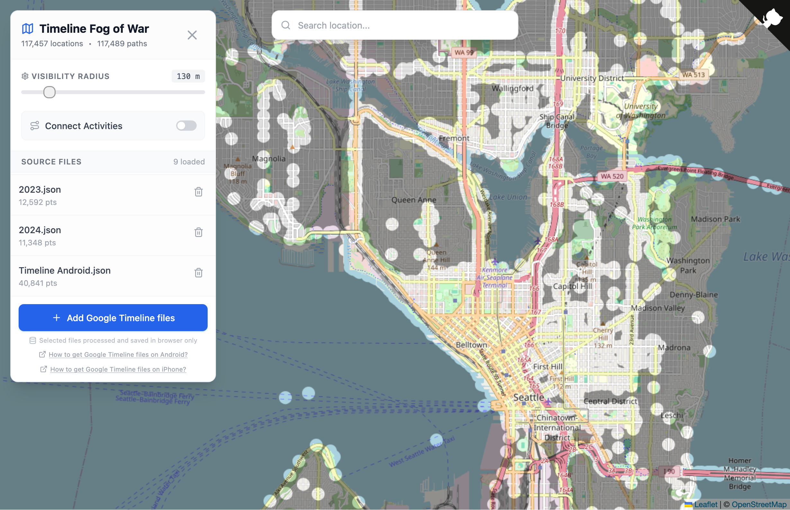

# Google Timeline Fog of War 🌁

[](https://github.com/ed-asriyan/google-timeline-fog-of-war/actions/workflows/CI.yml)
[](https://github.com/ed-asriyan/google-timeline-fog-of-war/actions/workflows/CD.yml)

Gamify your travel history! This application visualizes your Google Timeline location history by clearing the "Fog of War" from the world map as you explore.

<p align="center">
    <b>Live Demo: <a href="https://fogofwar.asriyan.me" target="_blank">https://fogofwar.asriyan.me</a></b>
</p>

<p align="center">
  
</p>

## ✨ Features
*   **Fog of War Mechanics**: The map is initially obscured. Your visited locations interactively clear the fog.
*   **Multi-Format Support**: 📱 Works with both Android and iOS Google Timeline export formats.
*   **Privacy First**: 🔒 **All processing happens locally in your browser.** Your location data is **never** uploaded to any server.
*   **Offline Capable**: Installable as a PWA (Progressive Web App) on desktop and mobile.
*   **Customizable**: Adjust visibility radius and toggle travel path connections.
*   **Persistent**: Data is saved locally in your browser (IndexedDB) so you don't have to re-upload every time.
*   **Responsive**: Works on desktop and mobile devices.

## 🚀 How to Use
1.  **Get your Data**:
    *   **Android**: Export Google Timeline files ([how to do it?](https://support.google.com/maps/answer/6258979?co=GENIE.Platform%3DAndroid&oco=1#androidimport))
    *   **iOS**: Export Google Timeline files ([how to do it?](https://support.google.com/maps/answer/6258979?co=GENIE.Platform%3DiOS&oco=1#iosimport))
2.  **Upload**:
    *   Open the app.
    *   Click "Add Google Timeline files".
    *   Select one or multiple JSON files (both Android and iOS formats are supported).
    *   **OR** if installed as a PWA, share JSON files directly from your file manager - the app will appear as a share target!
3.  **Explore**:
    *   Watch the fog vanish!
    *   Use the controls to tweak the visual settings.

## 📊 Supported Formats
The app automatically detects and parses both Google Timeline export formats:

### iOS Format
- Root structure: Array of timeline entries
- Location format: `geo:latitude,longitude`
- Activity types: lowercase (e.g., `"walking"`, `"in bus"`)

### Android Format
- Root structure: Object with `semanticSegments` array
- Location format: `"latitude°, longitude°"`
- Activity types: UPPERCASE (e.g., `"WALKING"`, `"IN_BUS"`)
- Additional `timelinePath` arrays with detailed point data

Both formats are fully supported with zero configuration required - just upload your files!

## 🛠️ Development
### Prerequisites
*   Node.js (v24+)
*   npm

### Installation
```bash
git clone https://github.com/ed-asriyan/google-timeline-fog-of-war.git
cd google-timeline-fog-of-war
npm ci
```

## 🏗️ Code Structure
```
src/
├── domain/               # Business logic (no dependencies)
├── application/          # Use cases & services
├── infrastructure/       # External systems (storage, parsers)
└── presentation/         # UI components & hooks
```

### Key Modules
- **domain/**: Core entities, value objects, domain services
- **application/**: Timeline file service, settings service
- **infrastructure/**: Timeline parsers (iOS/Android), repositories (IndexedDB, localStorage)
- **presentation/**: React components, custom hooks

**Architecture**: Clean Architecture / Domain-Driven Design  
📖 See [ARCHITECTURE.md](ARCHITECTURE.md) for detailed documentation  

### Run Locally
```bash
npm run dev
```

### Test
```bash
# Run tests once
npm test

# Watch mode (re-run on changes)
npm run test:watch

# Run tests with UI
npm run test:ui

# Run tests with coverage report
npm run test:coverage
```

### Build
```bash
npm run build
```

## 🏗️ Code Structure
```
src/
├── App.tsx                      # Main application component
├── main.tsx                     # Entry point
├── types.ts                     # TypeScript type definitions
└── utils/
    ├── timelineParser.ts        # Timeline data parser (Android/iOS formats)
    └── storage.ts               # IndexedDB utilities
```

### Key Modules
- **timelineParser.ts**: Handles automatic detection and parsing of both Android and iOS Google Timeline formats
- **storage.ts**: Manages IndexedDB operations for persistent local storage
- **types.ts**: Shared TypeScript interfaces and types

## 🏗️ Built With
*   [React](https://react.dev/)
*   [Vite](https://vitejs.dev/)
*   [Leaflet](https://leafletjs.com/) (Maps)
*   [Tailwind CSS](https://tailwindcss.com/)
*   [Vite PWA](https://vite-pwa-org.netlify.app/)
*   IndexedDB (Local Storage)

## 📄 License
This project is licensed under the MIT License - see the LICENSE file for details.
